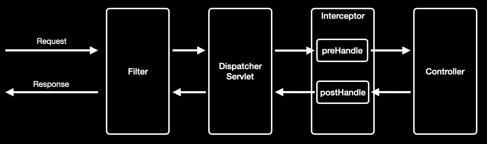
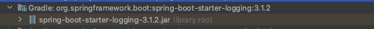

## Spring Interceptor

- 스프링 MVC 에서 컨트롤러에 들어오는 요청 전후로 호출되어 공통 관심 사항을 효과적으로 처리할 수 있는 기술

### Interceptor 흐름



- Interceptor 는 Dispatcher Servlet 와 컨트롤러 사이에 호출된다.
- Filter 와는 달리 컨트롤러 호출 전후에 처리할 작업을 preHandle, postHandle 등으로 구분할 수 있다.

### Interceptor 구현

- Interceptor 를 사용하기 위해서는 HandlerInterceptor 를 구현하여 등록한다.

    ```java
    /** HandlerInterceptor 구현 */
    @Slf4j
    @RequiredArgsConstructor
    public class LogInterceptor implements HandlerInterceptor {
    
        private final LogRepository logRepository;
        private final AES256Util aes256Util;
    
        @Override
        public boolean preHandle(HttpServletRequest request, HttpServletResponse response, Object handler) {
            saveLogHistory(request);
    
            return true;
        }
    
        private void saveLogHistory(HttpServletRequest request) {
            String username = getUsername();
    
            String ip = getIp(request);
    
            LogHistory logHistory = LogHistory.builder()
                .username(aes256Util.encrypt(username))
                .ip(aes256Util.encrypt(ip))
                .url(aes256Util.encrypt(request.getRequestURI()))
                .time(LocalDateTime.now())
                .build();
    
            logRepository.save(logHistory);
        }
    
        private String getUsername() {
            Object principal = SecurityContextHolder.getContext().getAuthentication().getPrincipal();
    
            if ("anonymousUser".equals(principal)) {
                return "anonymousUser";
            }
    
            User user = (User)principal;
            return user.getUsername();
        }
    
        private String getIp(HttpServletRequest request) {
            String ip = request.getHeader("X-FORWARDED-FOR");
            if (ip == null) {
                ip = request.getRemoteAddr();
            }
            return ip;
        }
    }
    
    /** 구현한 Interceptor 등록 */
    @Configuration
    public class WebConfig implements WebMvcConfigurer {
    
        @Override
        public void addInterceptors(InterceptorRegistry registry) {
            registry.addInterceptor(new LogInterceptor())
                .addPathPatterns("/**");    // 모든 요청에 인터셉터 적용
        }
    }
    ```
  
<br>

## Log

- 시스템의 상태 및 정보에 대한 기록
    - 에러가 발생할 경우 에러의 발생 시점 및 원인을 분석
    - 시스템의 디버깅이나 모니터링을 위하여 기록

### Log Level

- Log 레벨은 ****TRACE  <  DEBUG  <  INFO  <  WARN  <  ERROR 순으로 높은 레벨을 가진다.****
    - TRACE
        - Debug보다 훨씬 상세한 정보를 표시
    - DEBUG
        - 프로그램을 디버깅하기 위한 정보를 표시
    - INFO
        - 상태변경과 같은 정보성 로그를 표시
    - WARN
        - 처리 가능한 문제, 향후 시스템 에러의 원인이 될 수 있는 경고성 메시지를 표시
    - ERROR
        - 요청을 처리하는 중 오류가 발생한 경우 표시

### Spring Boot 에서의 Logging 사용

- Spring Boot 에서는 기본적으로 logging 을 위한 라이브러리가 spring-boot-starter-logging 를 통해 제공된다.

  

- log 설정
    - application.yml 을 통해 log 관련 설정

        ```yaml
        logging:
          level:
            root: info  #설정한 root 레벨 및 더 높은 레벨의 로그를 출력한다.
        ```


- log 사용
    - LoggerFactory 를 통해 logger 객체를 얻어와 사용

        ```java
        @RestController
        public class LogController {
            private final Logger logger = LoggerFactory.getLogger(this.getClass());
                
            @GetMapping("/log")
            public void test() {
                log.debug("log debug!!");
            }
        }
        ```

    - Lombok 에서 제공하는 @Slf4j 애노테이션 사용

        ```java
        @Slf4j
        @RestController
        public class LogController {
                
            @GetMapping("/log")
            public void test() {
                log.debug("log debug!!");
            }
        }
        
        // 빌드된 class 파일. @Slf4j 을 통해 log 필드가 자동으로 생성된다.
        @RestController
        public class LogController {
            private static final Logger log = LoggerFactory.getLogger(LogController.class);
        
            @GetMapping("/log")
            public void test() {
                log.debug("log debug!!");
            }
        }
        ```


### Log 기록 파일 저장
    
- resources 디렉토리 아래에 다음 파일을 생성
  - logback-spring.xml 설정

      ```xml
      <?xml version="1.0" encoding="UTF-8"?>
      <!-- 60초마다 설정 파일의 변경을 확인 하여 변경시 갱신 -->
      <configuration scan="true" scanPeriod="60 seconds">
            <!-- property 값을 읽어올 properties 파일 지정 -->
        <property resource="log.properties"/>
        
        <!--Environment 내의 프로퍼티들을 개별적으로 설정할 수도 있다.-->
        <springProperty scope="context" name="LOG_LEVEL" source="logging.level.root"/>
        <!-- log file path -->
        <property name="LOG_PATH" value="${log.config.path}"/>
        <!-- log file name -->
        <property name="LOG_FILE_NAME" value="${log.config.filename}"/>
        <!-- err log file name -->
        <property name="ERR_LOG_FILE_NAME" value="${log.config.error-file}"/>
        <!-- pattern -->
        <property name="LOG_PATTERN" value="%-5level %d{yy-MM-dd HH:mm:ss}[%thread] [%logger{0}:%line] - %msg%n"/>
        <!-- log level root -->
        <property name="LOG_LEVEL" value="${log.level.root}"/>
        
        <!-- Console Appender -->
        <appender name="CONSOLE" class="ch.qos.logback.core.ConsoleAppender">
            <encoder class="ch.qos.logback.classic.encoder.PatternLayoutEncoder">
                <pattern>${LOG_PATTERN}</pattern>
            </encoder>
        </appender>
        
        <!-- File Appender -->
        <appender name="FILE" class="ch.qos.logback.core.rolling.RollingFileAppender">
            <filter class="ch.qos.logback.classic.filter.LevelFilter">
                <level>info</level>
                <onMatch>ACCEPT</onMatch>
                <onMismatch>DENY</onMismatch>
            </filter>
            <!-- 파일경로 설정 -->
            <file>${LOG_PATH}/${LOG_FILE_NAME}.log</file>
            <!-- 출력패턴 설정-->
            <encoder class="ch.qos.logback.classic.encoder.PatternLayoutEncoder">
                <pattern>${LOG_PATTERN}</pattern>
            </encoder>
            <!-- Rolling 정책 -->
            <rollingPolicy class="ch.qos.logback.core.rolling.TimeBasedRollingPolicy">
                <!-- .gz,.zip 등을 넣으면 자동 일자별 로그파일 압축 -->
                <fileNamePattern>${LOG_PATH}/${LOG_FILE_NAME}.%d{yyyy-MM-dd}_%i.log</fileNamePattern>
                <timeBasedFileNamingAndTriggeringPolicy class="ch.qos.logback.core.rolling.SizeAndTimeBasedFNATP">
                    <!-- 파일당 최고 용량 kb, mb, gb -->
                    <maxFileSize>10MB</maxFileSize>
                </timeBasedFileNamingAndTriggeringPolicy>
                <!-- 일자별 로그파일 최대 보관주기(~일), 해당 설정일 이상된 파일은 자동으로 제거-->
                <maxHistory>30</maxHistory>
            </rollingPolicy>
        </appender>
        <!-- 에러의 경우 파일에 로그 처리 -->
        <appender name="Error" class="ch.qos.logback.core.rolling.RollingFileAppender">
            <filter class="ch.qos.logback.classic.filter.LevelFilter">
                <level>error</level>
                <onMatch>ACCEPT</onMatch>
                <onMismatch>DENY</onMismatch>
            </filter>
            <file>${LOG_PATH}/${ERR_LOG_FILE_NAME}.log</file>
            <encoder class="ch.qos.logback.classic.encoder.PatternLayoutEncoder">
                <!-- 이 옵션이 없을 경우 한글이 깨지는 경우 있음-->
                <charset>UTF-8</charset>
                <pattern>${LOG_PATTERN}</pattern>
            </encoder>
            <!-- Rolling 정책 -->
            <rollingPolicy class="ch.qos.logback.core.rolling.TimeBasedRollingPolicy">
                <!-- .gz,.zip 등을 넣으면 자동 일자별 로그파일 압축 -->
                <fileNamePattern>${LOG_PATH}/${ERR_LOG_FILE_NAME}.%d{yyyy-MM-dd}_%i.log</fileNamePattern>
                <timeBasedFileNamingAndTriggeringPolicy class="ch.qos.logback.core.rolling.SizeAndTimeBasedFNATP">
                    <!-- 파일당 최고 용량 kb, mb, gb -->
                    <maxFileSize>10MB</maxFileSize>
                </timeBasedFileNamingAndTriggeringPolicy>
                <!-- 일자별 로그파일 최대 보관주기(~일), 해당 설정일 이상된 파일은 자동으로 제거-->
                <maxHistory>60</maxHistory>
            </rollingPolicy>
        </appender>
        
        <!-- root레벨 설정 -->
        <root level="${LOG_LEVEL}">
            <appender-ref ref="CONSOLE"/>
            <appender-ref ref="FILE"/>
            <appender-ref ref="Error"/>
        </root>
      </configuration>  
      ```
            
  - logback-spring.xml 에서 지정한 resource 파일에 property 설정
            
      ```yaml
      # 생성된 log 파일 저장 경로
      log.config.path=/Users/ruby/Desktop/project/log-history/logs
      # log 파일명
      log.config.filename=log_history
      log.config.error-file=err_history
      # log root 레벨
      log.level.root=info
      ```
